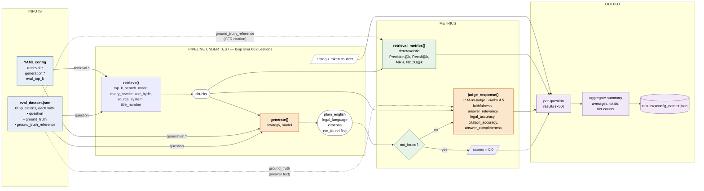

# Evaluation Harness — Per-Question Data Flow

Diagram of `eval/src/evaluate.py`. Each of the 60 questions in `eval_dataset.json` flows through the pipeline once per config run; retrieval and generation are scored through two independent metric paths (deterministic vs. LLM-as-judge).

**Orange = LLM call** (cost, latency, rubric risk live here).
**Green = deterministic** (cheap, reproducible).
**Dashed edges** carry ground truth into the metric layer.

## Notes

- **Ground truth splits two ways.** `ground_truth_reference` (a CFR section citation) is matched deterministically against `chunk.citation_string()` in `retrieval_metrics()`. `ground_truth` (the reference answer text) is passed to the LLM judge as the comparison target for faithfulness and legal accuracy.
- **`not_found` short-circuits the judge.** When the generator returns `not_found=True`, all five generation scores are hardcoded to `0.0` — this is why every not-found row in the results has `faithfulness=0.000` exactly. That zero is by construction, not a measurement.
- **Two independent cost profiles.** The retrieval path is free and reproducible. The judge path is one Haiku call per non-not-found question — ~60 extra calls per config run, plus the generation calls themselves.
- **Not shown (intentional):** confidence scoring, hierarchical retrieval's `max_sections` / `max_chars_per_section` assembly, HyDE query expansion, and the `--retrieval-only` fast path. They exist in the code but are orthogonal to the primary flow.
